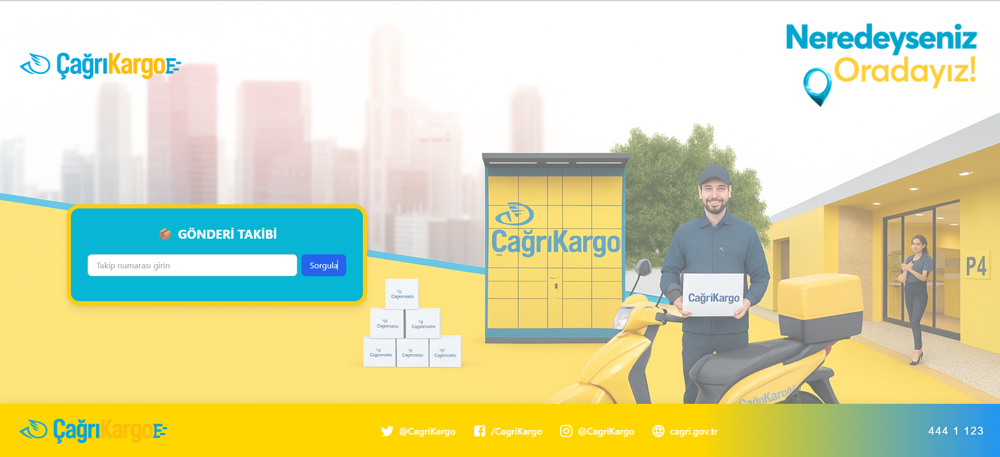
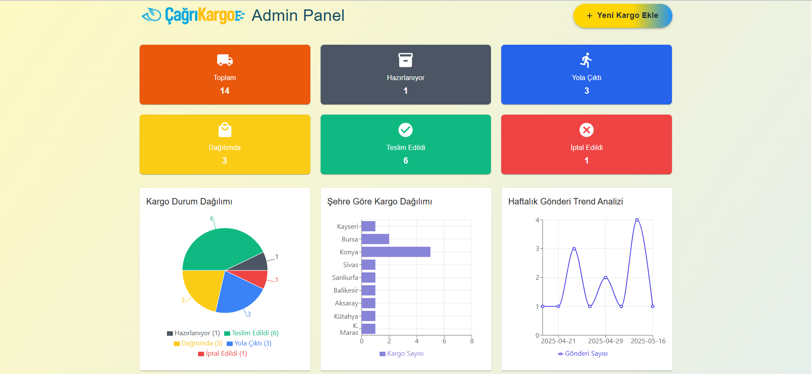
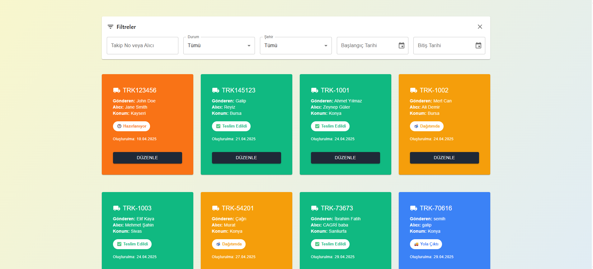
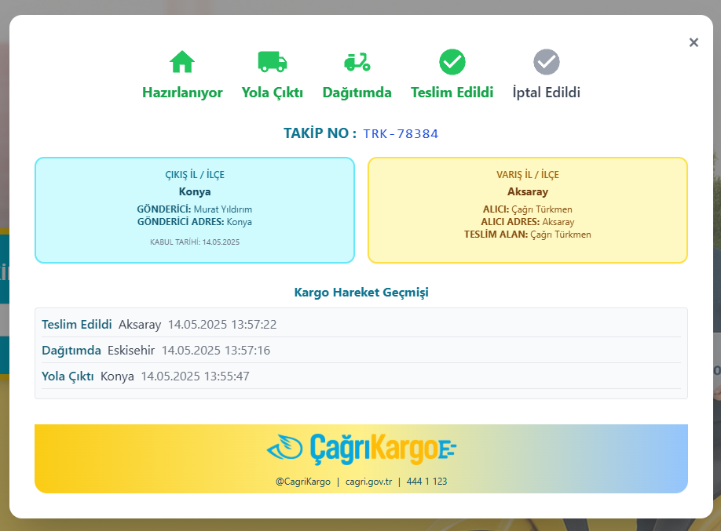
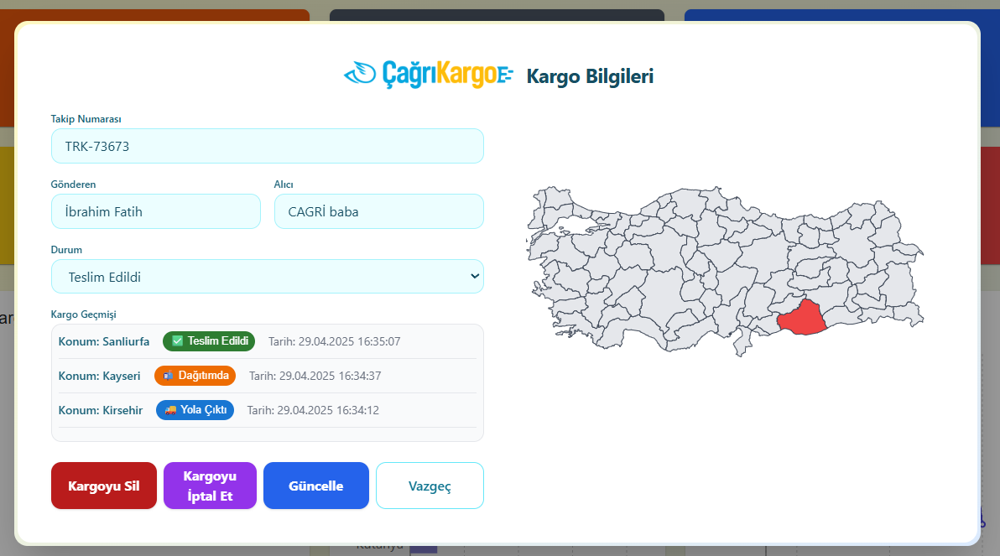
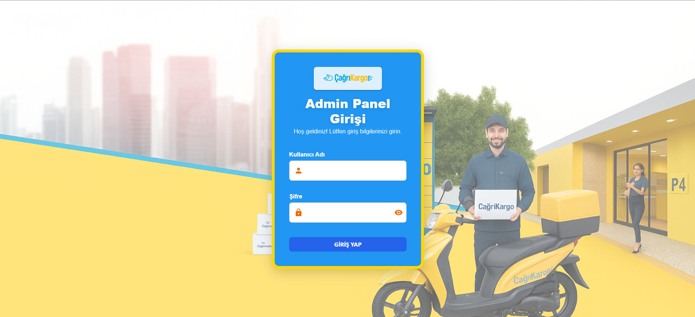
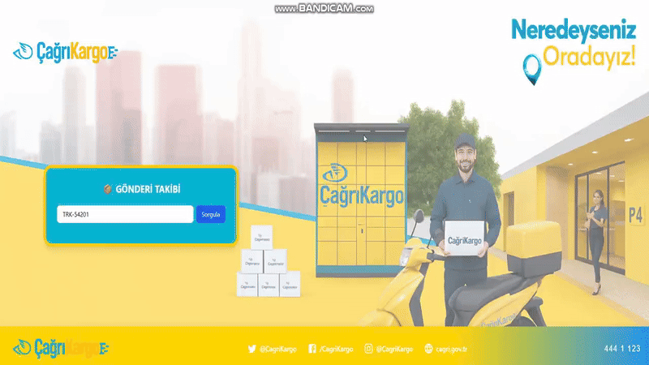

# 🚚 Cargo Tracking System

A modern and user-friendly cargo tracking system. Easily manage your cargo operations with real-time tracking, map integration, and detailed reporting features.

## ✨ Features

- 📍 Real-time cargo tracking
- 🗺️ Location display on the map
- 📊 Detailed reporting and analytics
- 👤 User management and authorization
- 📱 Responsive design
- 🔔 Notification system

## 🛠️ Technologies Used

### Frontend
- React 18
- Vite
- Material-UI (MUI)
- TailwindCSS
- React Router DOM
- Axios
- React Simple Maps
- Recharts
- React Hot Toast
- Date-fns

### Backend
- Node.js
- Express.js
- MongoDB (Mongoose)
- JWT Authentication
- Bcrypt
- CORS
- Dotenv

## 🚀 Installation

### Requirements
- Node.js (v14 or higher)
- MongoDB
- npm or yarn

### Frontend Setup
```bash
cd client
npm install
npm run dev
```

### Backend Setup
```bash
cd server
npm install
npm run dev
```

## 📁 Project Structure

```
├── client/                 # Frontend application
│   ├── src/
│   │   ├── components/    # Reusable components
│   │   ├── pages/         # Page components
│   │   ├── services/      # API services
│   │   └── utils/         # Utility functions
│   └── public/            # Static files
│
└── server/                # Backend application
    ├── config/           # Configuration files
    ├── controllers/      # Route controllers
    ├── middleware/       # Middleware functions
    ├── models/           # Mongoose models
    └── routes/           # API routes
```

## 🔐 Security

- JWT-based authentication
- Encrypted data transmission
- CORS protection
- Secure password hashing

## 📱 Screenshots

### Home Page


### Admin Panel



### Cargo Operations



### Login Screen


### System Overview


## 📝 License

This project is licensed under the MIT license. For details, see the [LICENSE](LICENSE) file.

